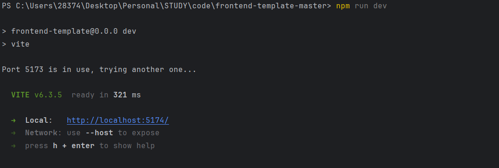
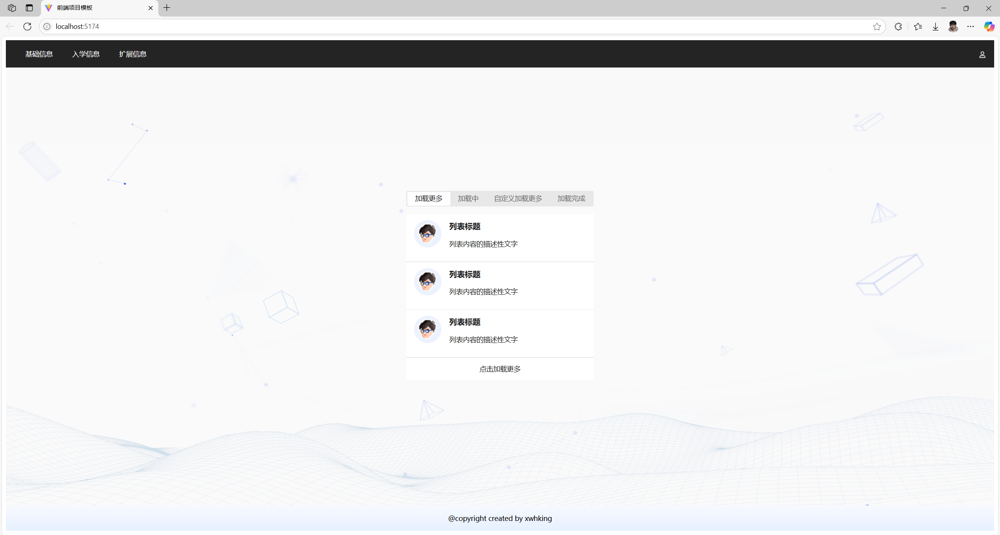
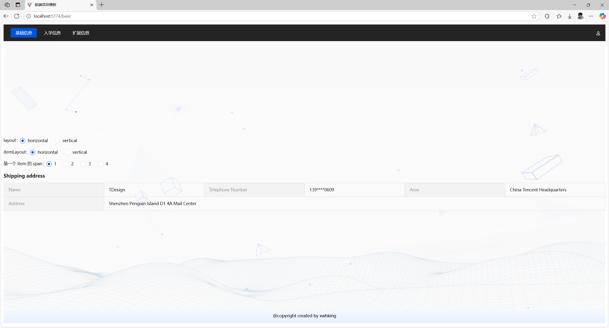
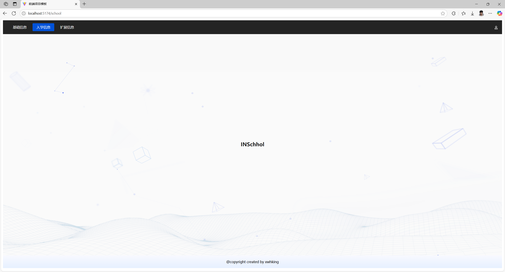
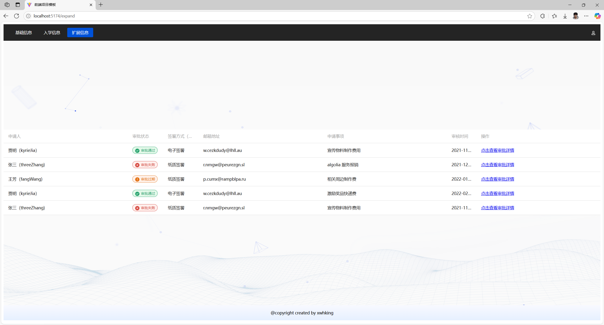
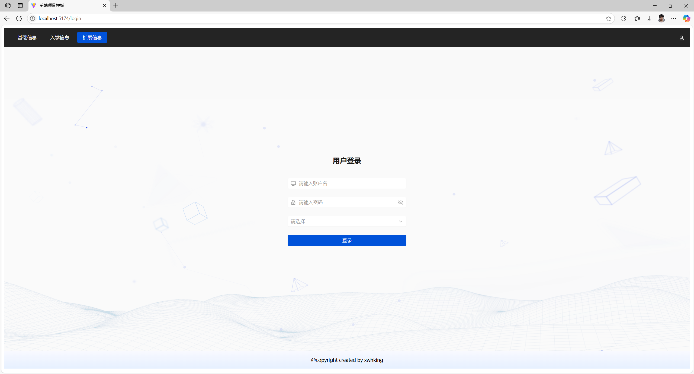

# 前端快速开发模板

### 技术栈

- Vue3 框架
- vue-router 单页面路由管理
- axios 请求组件
- TDesign Vue Next UI组件库 
- openapi 快速 API 匹配
- 其他也可自己定制

### 如何使用

1. 下载本项目代码
2. 在项目根目录运行`npm install` 下载依赖包
3. 运行项目`npm run dev`
4. 然后就可以得到：

### 运行效果

